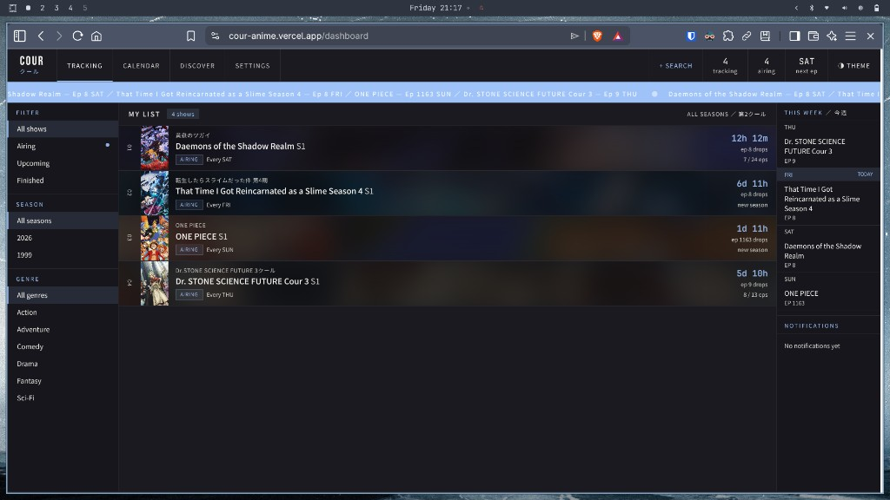
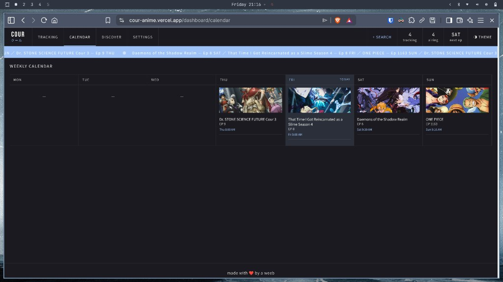
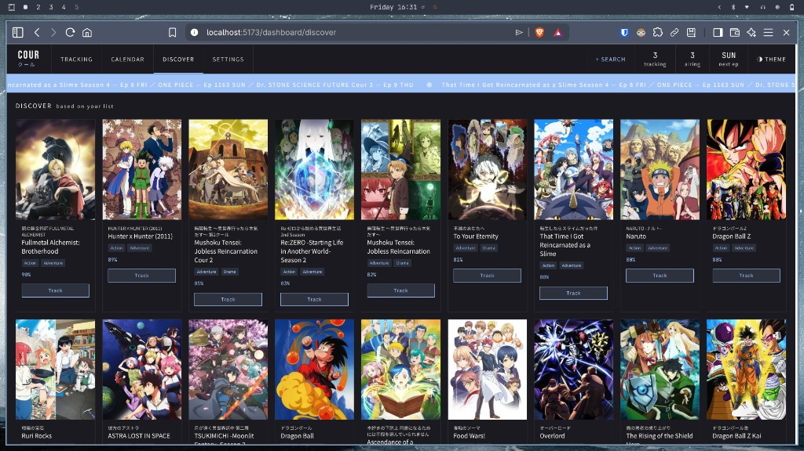
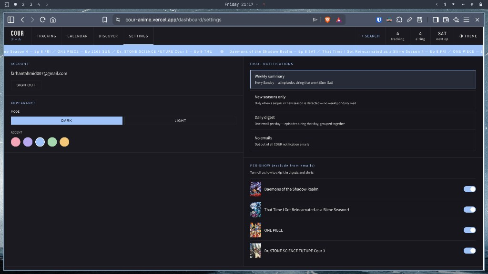

# Cour · クール

**Live demo:** [https://cour-anime.vercel.app](https://cour-anime.vercel.app)

A full-stack anime airing tracker — search and track shows, see episode countdowns, browse a weekly calendar, get genre-based recommendations, and receive email reminders when episodes air or a new season is announced.

Built as a portfolio project to show end-to-end product work: React UI, Supabase auth/data, AniList integration, serverless APIs, and transactional email on Vercel.

---

## Screenshots

### Dashboard — track list, filters, countdowns, weekly sidebar



### Calendar — weekly grid of airing episodes



### Discover — recommendations based on your tracked genres



### Settings — account, theme, email preferences



---

## Highlights for reviewers

| Area | What to look at |
|------|-----------------|
| **UX** | Dark/light themes + accent colors, cover-art row tints, live countdowns, airing ticker |
| **Calendar** | Full-week grid (Mon–Sun) with cover art, episode numbers, and local air times |
| **Data** | AniList GraphQL search + metadata; Supabase Postgres with RLS |
| **Auth** | Magic-link sign-in (no passwords stored in the app) |
| **Email** | Resend — weekly summary, daily digest, new-season alerts, per-show opt-out |
| **Ops** | Vercel Cron + keep-alive endpoint so the free-tier stack stays warm for demos |

**Try it:** Sign in with email on the [live demo](https://cour-anime.vercel.app), search for a show (+ Search), track it, then open **Settings** to pick a notification mode.

---

## Features

- **Track anime** — search via AniList, add/remove from your list with instant UI updates
- **Episode countdowns** — time until the next episode, progress (e.g. `7/24 eps`), airing day
- **Filters** — status (airing / upcoming / finished), season year, genres
- **Weekly calendar** — dedicated `/dashboard/calendar` view: episodes grouped by weekday with cover thumbnails and air times; today highlighted
- **Dashboard sidebar** — compact “this week” schedule alongside your tracked list
- **Ticker** — scrolling bar of next episodes across your list
- **Discover** — recommendations inferred from genres in your tracked list
- **Email notifications** (optional)
  - Weekly summary (Sundays, Sun–Sat window)
  - Daily digest (episodes airing today)
  - New season alerts (AniList sequel detection)
  - Unsubscribe / per-show exclude in Settings
- **Themes** — light and dark mode with accent color picker (Settings)

---

## Tech stack

| Layer | Tools |
|-------|--------|
| Frontend | React 18, Vite 6, React Router, TanStack Query, react-hot-toast |
| Backend | Vercel serverless functions (`/api/*`) |
| Database & auth | Supabase (Postgres, Row Level Security, magic links) |
| External API | AniList GraphQL |
| Email | Resend |
| Hosting | Vercel (`cour-anime.vercel.app`) |

---

## Architecture (short)

```
Browser (React SPA)
    → Supabase (auth + tracked_shows + profiles)
    → AniList GraphQL (search, airing times, sequel relations)

Vercel Cron (daily)
    → /api/cron/check-shows
    → Supabase + AniList + Resend (reminders & new-season mail)

UptimeRobot (optional)
    → /api/keep-alive (pings Supabase so free tier stays active)
```

---

## Local development

**Requirements:** Node 20+, a Supabase project, and env vars (see `.env.example`).

```bash
git clone https://github.com/tahmidft/cour.git
cd cour
npm install
cp .env.example .env   # fill in Supabase + optional Resend keys
npm run dev
```

Open [http://localhost:5173](http://localhost:5173).

For API routes locally (cron, email, keep-alive):

```bash
npx vercel dev
```

Useful scripts:

```bash
npm run resend:test          # smoke-test Resend from .env
npm run supabase:auth-urls   # sync auth redirect URLs (needs SUPABASE_ACCESS_TOKEN)
```

---

## Deploy

The app is configured for Vercel (`vercel.json` — SPA rewrites + daily cron). Set environment variables from `.env.example` in the Vercel project settings, then deploy from GitHub or `npx vercel --prod`.

---

## Repo structure

```
├── src/
│   ├── pages/          # Landing, Auth, Dashboard, Calendar, Discover, Settings
│   ├── components/     # Layout, ShowRow, ShowSearch, ThemePicker, Ticker
│   ├── hooks/          # useAuth, useTrackedShows, useTheme
│   └── lib/            # Supabase client, AniList, show utils
├── api/                # Vercel serverless (cron, email, keep-alive, unsubscribe)
├── supabase/           # Schema + migrations
└── docs/screenshots/   # README images
```

---

## Links

- **Live app:** [https://cour-anime.vercel.app](https://cour-anime.vercel.app)
- **Source:** [https://github.com/tahmidft/cour](https://github.com/tahmidft/cour)
- **AniList API:** [https://anilist.co/graphiql](https://anilist.co/graphiql)

---

## License

[GNU General Public License v3.0](LICENSE)
