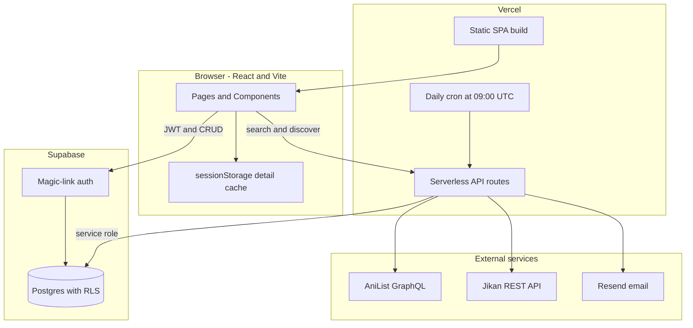
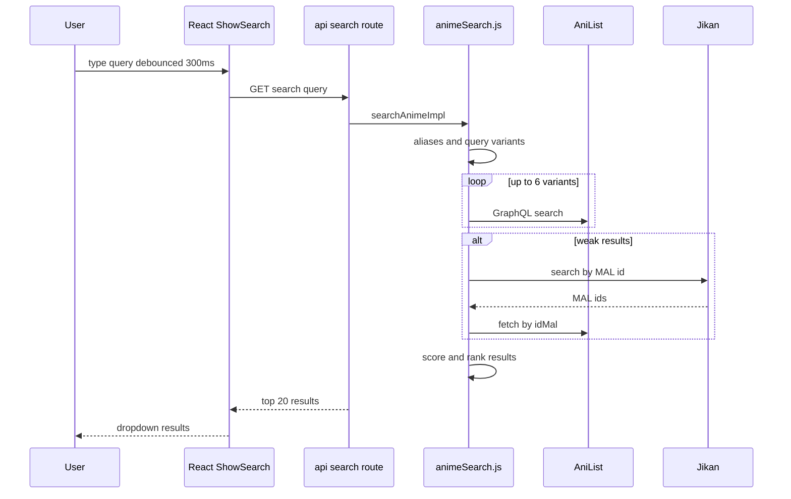
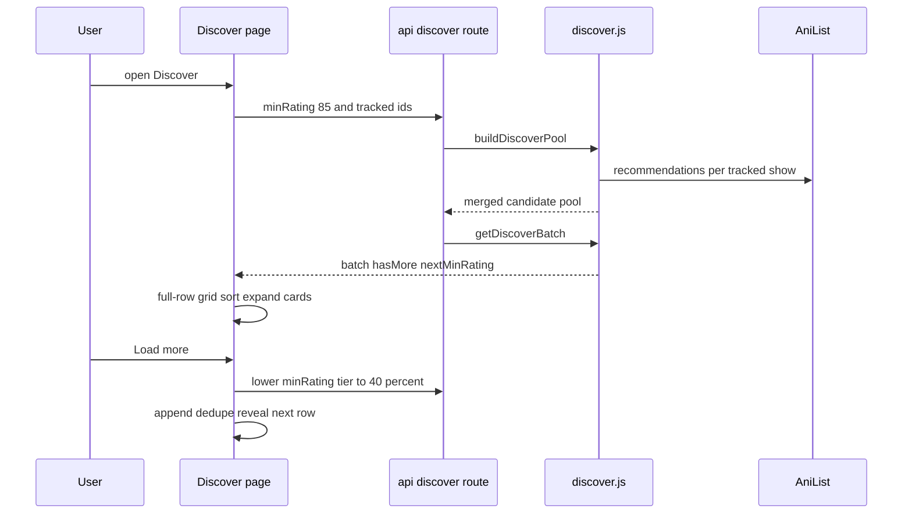
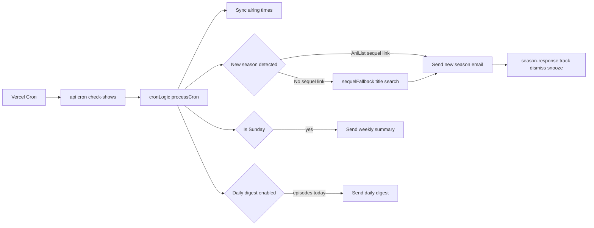

# Cour · クール

**Live demo:** [https://cour-anime.vercel.app](https://cour-anime.vercel.app)

Cour is a full-stack anime airing tracker and discovery app. Search and track shows, see live episode countdowns, browse a weekly calendar, get personalized recommendations, and receive email alerts when episodes air or a new season is announced.

This is a **portfolio project** built to demonstrate production-style engineering: custom search and recommendation logic on top of third-party APIs, serverless backend orchestration, auth and RLS with Supabase, and transactional email flows — not a thin API wrapper with a UI skin.

---

## Screenshots

### Dashboard — expandable show rows, filters, progress tracking, weekly sidebar


### Discover — personalized recommendations with in-grid expandable cards


### Calendar — weekly grid of airing episodes


### Settings — account, theme, email preferences


---

## What this project is

| | |
|---|---|
| **Problem** | Anime fans spread their watching across many streaming platforms. Watchlists and episode progress live inside each service — easy to lose track, and hard to recover when a platform goes down or removes a title. |
| **Solution** | Cour is a centralized, modern tracker for what you are watching now: one list, live countdowns, manual progress, and optional email summaries. Discover surfaces what to watch next, and new-season alerts help you pick up sequels without hunting across apps. |
| **Scope** | End-to-end: React SPA, Vercel serverless APIs, Supabase Postgres + RLS, AniList GraphQL, Resend email, daily cron jobs. |

---

## Features

- **Track anime** — search, add/remove from your list with instant UI updates
- **Expandable detail panels** — Netflix-style rows on Dashboard and Discover (synopsis, studios, tags, franchise season label)
- **Episode countdowns** — time until next episode, progress (`7/24 eps`), airing day
- **Manual progress tracking** — mark episodes complete; stored per user in Supabase
- **Filters** — status (airing / upcoming / finished), season year, genres
- **Weekly calendar** — `/dashboard/calendar`: episodes by weekday with cover thumbnails and local air times
- **Discover** — recommendations from your tracked genres; tiered load-more down to 40% similarity; sort by match %, score, or year
- **Strong search** — typos, abbreviations (`fmab`, `aot`), alias resolution, Jikan fallback
- **Email notifications** (optional)
  - Weekly summary (Sun–Sat window)
  - Daily digest (episodes airing today)
  - New season alerts with **one-click track / dismiss / snooze** from the inbox
  - Unsubscribe and per-show opt-out in Settings
- **Themes** — light/dark mode with accent color picker

---

## System architecture

Cour is a React SPA on Vercel. The browser talks to **Supabase** for auth and user data, and to **Vercel serverless functions** for search, discover, anime detail, email actions, and cron. Those functions call **AniList** (and Jikan as fallback), **Resend** for email, and **Supabase Admin** where RLS must be bypassed (cron, email links).



### Component responsibilities

| Component | Role in Cour |
|-----------|----------------|
| **Vercel** | Hosts SPA + API routes; SPA rewrites; daily cron trigger |
| **Supabase** | User auth (OTP magic links), `profiles`, `tracked_shows`, `season_prompts`, `notification_log`; RLS enforces per-user data |
| **AniList** | Raw anime metadata, search, recommendations, airing times, SEQUEL/PREQUEL relations |
| **Resend** | Delivers weekly/daily/new-season emails; HTML templates with signed action links |
| **Jikan** | Fallback search path when AniList returns weak results (MAL id → AniList lookup) |

---

## Request flows

### Search (user types in + Search modal)



### Discover (personalized recommendations)



### Daily cron (airing sync + email)



---

## Engineering highlights (what I built vs what APIs provide)

Recruiters often see “AniList API + React UI.” Cour adds substantial **application logic** on top of raw API responses.

### 1. Multi-stage anime search (`api/lib/animeSearch.js`, `searchAliases.js`)

| AniList gives | Cour adds |
|---------------|-----------|
| Substring GraphQL search | **Alias map** (`fmab` → Fullmetal Alchemist Brotherhood, `aot`, typos) |
| Unordered result list | **Custom scoring**: token overlap, Levenshtein distance (≤2), subsequence match, alias boosts, anti-confusion penalties (e.g. Full Metal Panic vs FMA) |
| Single query | **Variant expansion** (spaced/compacted titles, up to 6 attempts) |
| One data source | **Jikan fallback** → MAL id → AniList `idMal` bridge when AniList is weak |
| Unbounded calls | **400ms global queue** (`anilistClient.js`) + **60s search cache** on `/api/search` |

### 2. Discover recommendation engine (`api/lib/discover.js`, `Discover.jsx`)

| AniList gives | Cour adds |
|---------------|-----------|
| Per-show recommendation lists | **Pool merge**: up to 8 tracked shows → dedupe by id, **keep highest similarity rating** |
| Static list | **Tiered similarity floor**: start 85%, step −15% down to 40% on “Load more” |
| N/A | **Full-row grid pagination**: `ResizeObserver` column count, only show complete rows while more data exists, fetch until next row fillable |
| N/A | Client sort (match %, AniList score, season year) without re-fetching |

### 3. Franchise season labeling (`api/lib/franchiseSeasons.js`)

| AniList gives | Cour adds |
|---------------|-----------|
| PREQUEL / SEQUEL edges | Walk prequels to **franchise root**, follow sequels to build **ordered chain** |
| Per-media relation | Cached `{ seasonIndex, totalSeasons }` → UI label **“Season 3 of 5”** on detail panels |

### 4. New-season detection fallback (`api/lib/sequelFallback.js`)

| AniList gives | Cour adds |
|---------------|-----------|
| SEQUEL relation when present | When missing: **budgeted title search** (max ~20 extra queries/run) |
| N/A | Tier 1: `"Title Season N"` token matching; Tier 2: `"Title Final Season"` for split-cour announcements |
| N/A | `season_prompts` table: pending / dismissed / snoozed / tracked; 14-day snooze |

### 5. Email action pipeline (`api/season-response.js`, `emailTemplates.js`)

| Resend gives | Cour adds |
|--------------|-----------|
| SMTP delivery | HTML templates with **signed one-click URLs** (track sequel, dismiss, snooze) |
| N/A | Track from email → insert `tracked_shows`, mark parent season complete, send confirmation, re-enable notifications if user had opted out |
| N/A | **`notification_log`** idempotency keys so cron never double-sends the same weekly/daily/new-season mail |

### 6. Frontend performance & UX

| Concern | Implementation |
|---------|----------------|
| AniList rate limits | Detail prefetch **queue** (420ms gap), sessionStorage cache (48 entries) |
| Discover layout | CSS grid with `span 2` expand-in-place; remaining cards reflow |
| Auth magic links | Callback URL detection delays route guard until `?code=` / hash tokens resolve |
| Tracked list | Expandable `ShowRow` + `ShowDetailPanel`; lazy `/api/anime` fetch on expand |

---

## Tech stack

| Layer | Tools |
|-------|--------|
| Frontend | React 18, Vite 6, React Router, TanStack Query, react-hot-toast |
| Backend | Vercel serverless functions (`/api/*`) |
| Database & auth | Supabase (Postgres, Row Level Security, magic links) |
| External API | AniList GraphQL; Jikan v4 (search fallback) |
| Email | Resend |
| Hosting | Vercel · [cour-anime.vercel.app](https://cour-anime.vercel.app) |

---

## Database (Supabase)

| Table | Purpose |
|-------|---------|
| `profiles` | Email, theme/accent, `notification_mode`, `notify_token` for unsubscribe links |
| `tracked_shows` | User list: AniList id, airing metadata, `episodes_watched`, genres JSON, per-show email toggle |
| `season_prompts` | New-season inbox state: parent/sequel ids, snooze until, dismissed/tracked |
| `notification_log` | Dedupe keys for cron emails (`weekly_summary_…`, `daily_digest_…`, `new_season_…`) |

RLS: users read/write only their own rows. Cron and email endpoints use the **service role** via `supabaseAdmin.js`.

---

## API routes

| Route | Description |
|-------|-------------|
| `GET /api/search` | Ranked anime search (cached 60s) |
| `GET /api/anime?id=` | Full detail + franchise season info (cached 5m) |
| `GET /api/discover` | Recommendation batch with similarity tier |
| `GET /api/cron/check-shows` | Daily sync + email (Bearer `CRON_SECRET`) |
| `GET /api/season-response` | Email one-click track / dismiss / snooze |
| `GET/POST /api/unsubscribe` | Opt out of emails |
| `GET /api/keep-alive` | Supabase ping for free-tier uptime |

---

## Local development

**Requirements:** Node 20+, Supabase project, env vars (see `.env.example`).

```bash
git clone https://github.com/tahmidft/cour.git
cd cour
npm install
cp .env.example .env   # Supabase + optional Resend keys
npx vercel dev         # SPA + /api on http://localhost:3000
```

Plain `npm run dev` (port 5173) works for UI-only; API routes need `vercel dev` or a deployed backend.

```bash
npm run resend:test          # smoke-test Resend
npm run supabase:auth-urls   # sync auth redirect URLs
```

---

## Deploy

Configured for Vercel (`vercel.json`: Vite build, SPA rewrites, cron at `0 9 * * *` UTC).

1. Connect the GitHub repo to Vercel
2. Set env vars from `.env.example` (`VITE_SUPABASE_*`, `SUPABASE_SECRET_KEY`, `RESEND_*`, `CRON_SECRET`, `VITE_APP_URL`)
3. Deploy from `main` — production URL: **https://cour-anime.vercel.app**

Optional: point UptimeRobot at `/api/keep-alive` to keep Supabase active on the free tier.

---

## Repo structure

```
├── src/
│   ├── pages/          # Dashboard, Calendar, Discover, Settings, Auth
│   ├── components/     # ShowRow, ShowDetailPanel, DiscoverDetailPanel, SeasonPromptBanner
│   ├── hooks/          # useAuth, useTrackedShows, useSeasonPrompts
│   └── lib/            # search client, discover labels, anime detail cache
├── api/
│   ├── lib/            # search, discover, cron, sequel fallback, franchise, email
│   ├── cron/           # check-shows
│   └── *.js            # route handlers
├── supabase/           # schema + migrations
└── docs/screenshots/   # README images
```

---

## Links

- **Live app:** [https://cour-anime.vercel.app](https://cour-anime.vercel.app)
- **Source:** [https://github.com/tahmidft/cour](https://github.com/tahmidft/cour)
- **AniList API:** [https://anilist.co/graphiql](https://anilist.co/graphiql)

---

## License

[GNU General Public License v3.0](LICENSE)
